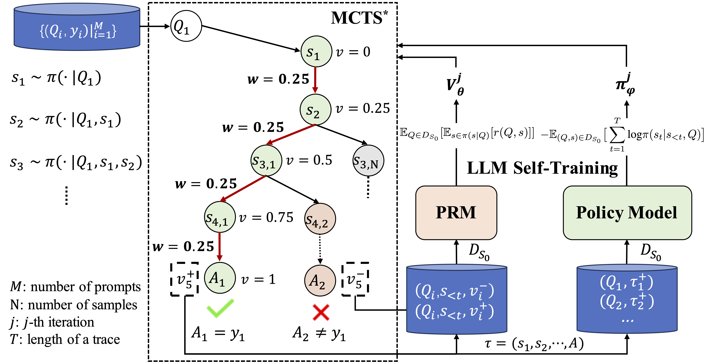
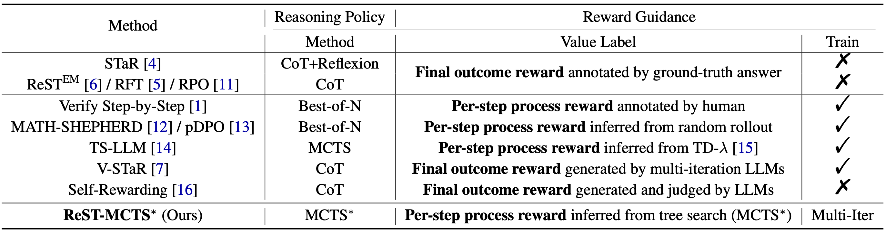
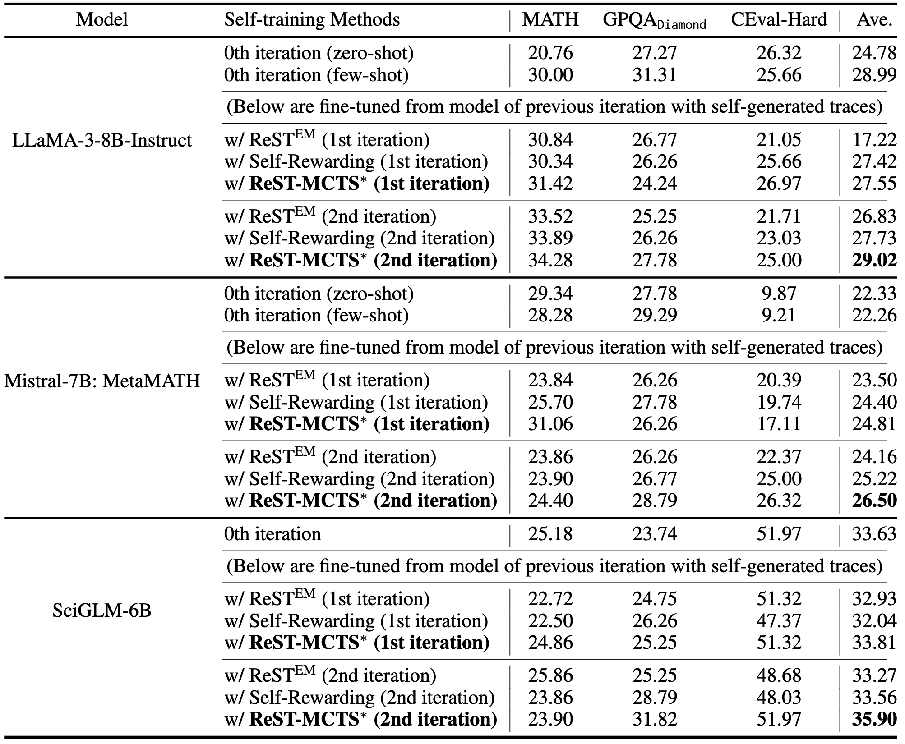
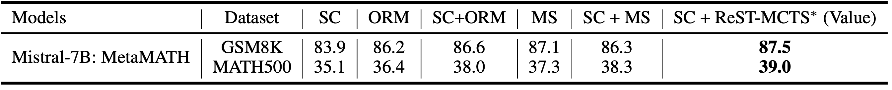
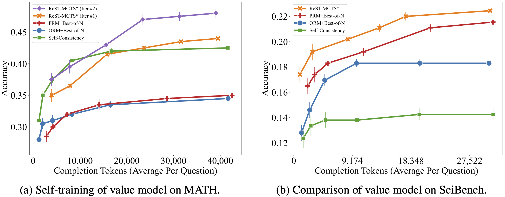

# ReST-MCTS*: LLM Self-Training via Process Reward Guided Tree Search

<p align="center">
📃 <a href="https://arxiv.org/abs/2406.03816" target="_blank">[ReST-MCTS*]</a> 
<a href="https://github.com/THUDM/ReST-MCTS" target="_blank">[GitHub]</a>
<a href="https://rest-mcts.github.io/" target="_blank">[Website]</a> <br>
</p>

We develop a reinforced self-training approach, called **ReST-MCTS***, based on integrating process reward guidance with tree search MCTS* for collecting higher-quality reasoning traces as well as per-step value to train policy and reward models. **ReST-MCTS*** circumvents the per-step manual annotation typically used to train process rewards by tree-search-based reinforcement learning: Given oracle final correct answers, **ReST-MCTS*** is able to infer the correct process rewards by estimating the probability this step can help lead to the correct answer. These inferred rewards serve dual purposes: they act as value targets for further refining the process reward model and also facilitate the selection of high-quality traces for policy model self-training.



## **Table of Contents**

- [Key Differences](#introduction)
- [Data & Model](#data&model)
- [Getting Started](#started)
- [Leaderboard](#Leaderboard)
- [Citation](#Citation)

## **Key Differences**


## **Data & Model**
Take Llama3-8b-Instruct as an example:

Download policy data:
[[Hugging Face](https://huggingface.co/datasets/zd21/ReST-MCTS-Llama3-8b-Instruct-Policy-1st)]

Download PRM data:
[[Hugging Face](https://huggingface.co/datasets/zd21/ReST-MCTS-Llama3-8b-Instruct-PRM-1st)]

Download model:
[[Hugging Face](https://huggingface.co/zd21/ReST-MCTS-Llama3-8b-Instruct-Policy-1st)]

## **Getting Started**

### **Prepare Env**
You should install the required packages by running
```bash
pip install -r requirements.txt
```
Note that for some models on huggingface like the GLM series, you may need to install specific versions of `transformers`.

### **Model Implementation**
To run MCTS* search, you should implement a policy as well as a process reward model (value model).
You can directly set these models by providing the model paths in the file `models/model.py`, substituting `INFERENCE_MODEL_DIR`, `VALUE_BASE_MODEL_DIR` and `VALUE_MODEL_STATE_DICT`.
However, due to some considerations, we now only provide the implementation of the `llama`, `glm` and `mistral` as policy, with `glm` and `mistral` as value model.
If you are trying with other models, you can refer to our implementation and modify relevant codes to implement the corresponding models.
Once you've implemented the policy and value model, you should modify the `LOCAL_INFERENCE_IDX` and `LOCAL_VALUE_IDX` in `models/model.py` to the corresponding model index.

### **Data Preparation**
Before running search for evaluation or generation, you have to make sure your target question dataset is in the correct format. 
The data file should be a json file with items in the following format:
```json
{
  "content": "Calculate the sum of the first 10 prime numbers.",
  "answer": "129"
}
```
The `content` entry is required, serving as the question. While the `answer` entry is optional, it is used for evaluation.

### **Run MCTS\* Search**
The implementation of MCTS* search can be found in `MCTS`. We provide a search interface in `MCTS/task.py`. To run MCTS* search for a single question, you can refer to the following script:

```python
from MCTS.task import *
question = "Calculate the sum of the first 10 prime numbers."
task = MCTS_Task(question, 'llama', 'local', lang='en')
output = task.run()
print(output['solution'])
```

For evaluation of MCTS* on benchmarks, you can refer to `evalaute.py`, setting the parameter `--mode` to "mcts". You should specify the benchmark name and the exact file (subset) you want to evaluate. A simple demonstration is provided below:
```bash
python evaluate.py \
  --task_name "scibench" \
  --file "thermo" \
  --propose_method "gpt" \
  --value_method "local" \
  --mode "mcts" \
  --evaluate "scibench" \
  --iteration_limit 50 \
  --use_reflection "simple" \
  --branch 3
```
You can also refer to the `MCTS/args.md` for more details on the search parameters.

## **Leaderboard**

Self-training Results:



Accuracy of Different Verifiers:



Accuracy of Different Searches:



## **Citation**

If you find our work helpful, please kindly cite our paper:

```
@misc{zhang2024restmcts,
      title={ReST-MCTS*: LLM Self-Training via Process Reward Guided Tree Search}, 
      author={Dan Zhang and Sining Zhoubian and Yisong Yue and Yuxiao Dong and Jie Tang},
      year={2024},
      eprint={2406.03816},
      archivePrefix={arXiv},
      primaryClass={cs.CL}
}
```
