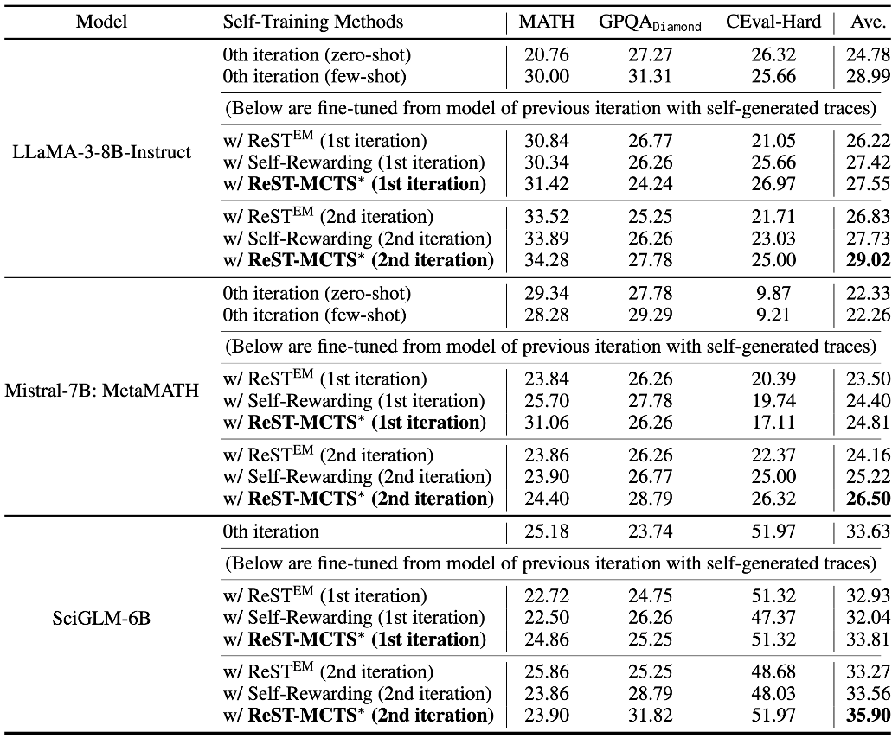

# ReST-MCTS*: LLM Self-Training via Process Reward Guided Tree Search

<p align="center">
📃 <a href="https://arxiv.org/abs/2406.03816" target="_blank">[ReST-MCTS*]</a> 
<a href="https://github.com/THUDM/ReST-MCTS" target="_blank">[GitHub]</a>
<a href="https://rest-mcts.github.io/" target="_blank">[Website]</a> <br>
</p>

We develop a reinforced self-training approach, called **ReST-MCTS***, based on integrating process reward guidance with tree search MCTS* for collecting higher-quality reasoning traces as well as per-step value to train policy and reward models. **ReST-MCTS*** circumvents the per-step manual annotation typically used to train process rewards by tree-search-based reinforcement learning: Given oracle final correct answers, **ReST-MCTS*** is able to infer the correct process rewards by estimating the probability this step can help lead to the correct answer. These inferred rewards serve dual purposes: they act as value targets for further refining the process reward model and also facilitate the selection of high-quality traces for policy model self-training.


## **Table of Contents**

- [Key Differences](#introduction)
- [Getting Started](#started)
- [Data & Model](#data&model)
- [Self-training](#Self-training)
- [Leaderboard](#Leaderboard)
- [Citation](#Citation)

## **Key Differences**
We summary the key differences between existing self-improvement methods and our approach. Train refers to whether to train a reward model.


## **Getting Started**

### **Prepare Env**
Considering the different dependency versions of `transformers` for Mistral (or Llama) and SciGLM, you should install different environments through miniconda and install corresponding required packages by:
 
running Mistral (or Llama)
```bash
pip install -r requirements_mistral.txt
```

or running SciGLM
```bash
pip install -r requirements_sciglm.txt
```
Note that for some models on huggingface like the GLM series, you may need to install specific versions of `transformers`.

The Python version for running GLM is 3.11. The Python version for running Mistral or Llama is 3.12.

### **Model Implementation**
#### **MCTS\* Search**
To run MCTS* search, you should implement a policy as well as a process reward model (value model).
You can download initial checkpoint and directly set these models by providing the model paths in the file `models/model.py`, substituting `INFERENCE_MODEL_DIR`, `VALUE_BASE_MODEL_DIR` and `VALUE_MODEL_STATE_DICT`.

##### **Policy Model**
`INFERENCE_MODEL_DIR` is the local path to the policy model, model could be <a href="https://huggingface.co/meta-llama/Meta-Llama-3-8B-Instruct/" target="_blank">[Llama3-8B-Instruct]</a>, <a href="https://huggingface.co/meta-math/MetaMath-Mistral-7B" target="_blank">[Mistral-7B: MetaMATH]</a>, and <a href="https://huggingface.co/zd21/SciGLM-6B" target="_blank">[SciGLM-6B]</a>.

##### **Process Reward Model**
`VALUE_BASE_MODEL_DIR` is the local path to the value model. Considering the different dependency versions of `transformers`, Mistral-7B is adopted as the backbone of the value model when the policy model is <a href="https://huggingface.co/meta-llama/Meta-Llama-3-8B-Instruct/" target="_blank">[Llama3-8B-Instruct]</a> or <a href="https://huggingface.co/meta-math/MetaMath-Mistral-7B" target="_blank">[Mistral-7B: MetaMATH]</a>. When the policy model is <a href="https://huggingface.co/zd21/SciGLM-6B" target="_blank">[SciGLM-6B]</a>, we use <a href="https://huggingface.co/THUDM/chatglm3-6b" target="_blank">[ChatGLM3-6B]</a> as the backbone of the value model.

Aiming to gather value train data for science, we integrate questions of a lean science dataset $D_{sci}$ within <a href="https://rest-mcts.github.io/" target="_blank">[SciInstruct]</a> to construct $D_{V_0}$. This dataset consists of 11,554 questions, where each question is paired with a correct step-by-step solution. (See **Fine-grained dataset for science and math.** in Section 4.1 of <a href="https://arxiv.org/pdf/2406.03816" target="_blank">[the paper]</a> for more details.)

You can download [[$D_{V_0}$](https://huggingface.co/datasets/zd21/ReST-MCTS-PRM-0th)] and put them in `PRM/data` to train Mistral-7B as the initial process reward model and obtain `VALUE_MODEL_STATE_DICT`.
We also provide `PRM/train_VM_chatglm.py` and `PRM/train_VM_mistral.py`.

The experimental settings are as follows:

For ChatGLM3-6B, learning rate (lr) is 2e-5, the number of epochs is 2 or 3, and batch size is 3.

For Mistral, learning rate (lr) is 3e-6, the number of epochs is 2 or 3, and batch size is 3.

##### **Model Setting**
We now only provide the implementation of the `llama`, `glm` and `mistral` as policy, with `glm` and `mistral` as value model in `models/model.py`.
If you are trying with other models, you can refer to our implementation and modify relevant codes to implement the corresponding models.
Once you've implemented the policy and value model, you should modify the `LOCAL_INFERENCE_IDX` and `LOCAL_VALUE_IDX` in `models/model.py` to the corresponding model index.

### **Data Preparation**
Before running search for evaluation or generation, you have to make sure your target question dataset is in the correct format. 
The data file should be a json file with items in the following format:
```json
{
  "content": "Calculate the sum of the first 10 prime numbers.",
  "answer": "129"
}
```
The `content` entry is required, serving as the question. While the `answer` entry is optional, it is used for evaluation.

### **Run MCTS\* Search**
The implementation of MCTS* search can be found in `MCTS`. We provide a search interface in `MCTS/task.py`. To run MCTS* search for a single question, you can refer to the following script:

```python
from MCTS.task import *
question = "Calculate the sum of the first 10 prime numbers."
task = MCTS_Task(question, 'llama', 'local', lang='en')
output = task.run()
print(output['solution'])
```

For evaluation of MCTS* on benchmarks, you can refer to `evaluate.py`, setting the parameter `--mode` to "mcts". You should specify the benchmark name and the exact file (subset) you want to evaluate. A simple demonstration is provided below:
```bash
python evaluate.py \
  --task_name "scibench" \
  --file "thermo" \
  --propose_method "gpt" \
  --value_method "local" \
  --mode "mcts" \
  --evaluate "scibench" \
  --iteration_limit 50 \
  --use_reflection "simple" \
  --branch 3
```
You can also refer to the `MCTS/args.md` for more details on the search parameters.

## **Data & Model (take Llama3-8B-Instruct as an example)**
Given question set $D_G$, we use Llama3-8B-Instruct guided by MCTS* to generate synthetic data for policy model and value model. (See **Algorithm 1** of <a href="https://arxiv.org/pdf/2406.03816" target="_blank">[the paper]</a> for more details.)

Download policy data (positive samples) for training 1st policy model (Llama3-8b-Instruct):
[[Hugging Face](https://huggingface.co/datasets/zd21/ReST-MCTS-Llama3-8b-Instruct-Policy-1st)]

Download PRM data (positive and negative samples) for training 1st reward model (Mistral-7B: MetaMATH):
[[Hugging Face](https://huggingface.co/datasets/zd21/ReST-MCTS-Llama3-8b-Instruct-PRM-1st)]

Download the trained policy model:
[[Hugging Face](https://huggingface.co/zd21/ReST-MCTS-Llama3-8b-Instruct-Policy-1st)]

## **Self-training**
For our methods:

Regarding Llama3-8B-Instruct and Mistral-7B: MetaMATH, we use the default repo of <a href="https://github.com/TIGER-AI-Lab/MAmmoTHhttps://github.com/TIGER-AI-Lab/MAmmoTH" target="_blank">[MAmmoTH]</a> to train the policy model and evaluate.

Regarding SciGLM-6B, we use the default repo of <a href="https://github.com/THUDM/SciGLM" target="_blank">[SciGLM]</a> to train the policy model and evaluate.

We also implement self-rewarding as our baseline in ./self_train/self_train_dpo.py.

## **Leaderboard**

Self-training Results:



Accuracy of Different Verifiers:


Accuracy of Different Searches (we also provide the plot code in `figures/plot_math_self_training.py`):


## **Citation**

If you find our work helpful, please kindly cite our paper:

```
@article{zhang2024rest,
  title={ReST-MCTS*: LLM Self-Training via Process Reward Guided Tree Search},
  author={Zhang, Dan and Zhoubian, Sining and Hu, Ziniu and Yue, Yisong and Dong, Yuxiao and Tang, Jie},
  journal={arXiv preprint arXiv:2406.03816},
  year={2024}
}
```
